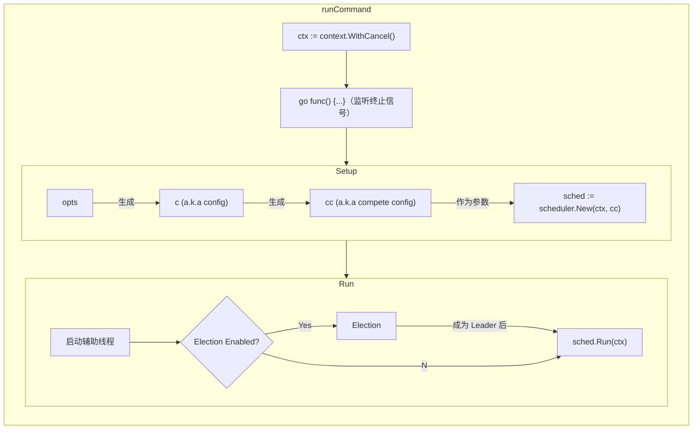
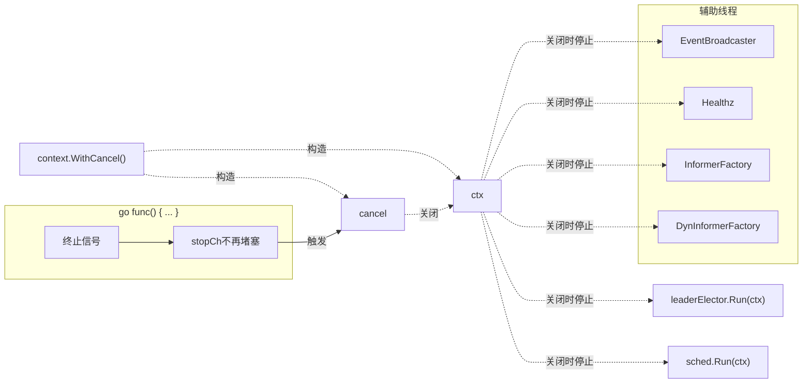
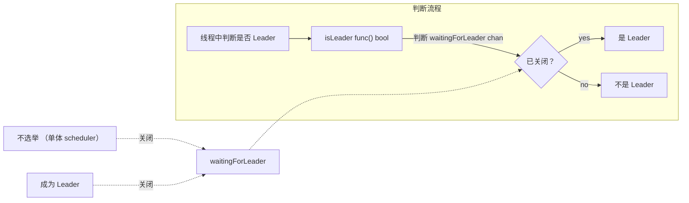

# Scheduler

我们看 release-1.23.5 版，commit sha 为 `8ccdbcc8bfc` 。
切到 release-1.23 分支： `git checkout release-1.23`
同时我们维护一个 TODO 列表。

## cmd 入口

入口在 `/cmd/kube-scheduler/` 下，以下路径为 `/cmd/kube-scheduler/` 的相对路径。

```go ./scheduler.go
func main() {
	command := app.NewSchedulerCommand()
	code := cli.Run(command)
	os.Exit(code)
}
```

我们看到 `main()` 函数结构很清晰，把鼠标放到 command 变量上，看到它的类型是我们熟悉的 `*cobra.Command` 。
![[2022-04-05-20-58-53.png]]
那我们就明白 scheduler 用的是有名的 `cobra` 命令行库了（当然这也是基础知识了）。
而我们知道 cobra 框架实际运行的是 `Command` 对象下的 `Run` 函数对象成员。因此接下来的应该在 `./app` 的 `NewSchedulerCommand()` 中去找 `command` 的构建，以及其 `Run` 成员。
而 `cli.Run()` 我们点进去稍微看一下，是命令行 Flag 格式标准化、随机数初始化，还有 `command` 的 `Execute()` 步骤，以及保证边缘情况下也能打印 log 的一些步骤。这些都明显不重要，看一眼就过了。

沿着 `app.NewSchedulerCommand()` 一路寻下去：

```go ./app/server.go

// NewSchedulerCommand creates a *cobra.Command object with default parameters
func NewSchedulerCommand() *cobra.Command {
	opts := options.NewOptions()

	cmd := &cobra.Command{
		Use: "kube-scheduler",
		// Long: 
		RunE: func(cmd *cobra.Command, args []string) error {
			return runCommand(cmd, opts, registryOptions...) // <= 重点
		},
		// Args: 
	}

    // 又是一些 flag 设置

	return cmd
}
```

这一段主要是生成 cobra cmd 对象，我们知道 cobra 命令行的执行入口在于 `cmd.Run` ， `runCommand` 就必然是我们接下来关注的目标。
在 `cmd` 对象构建前用 `NewOptions()` 构造出 `*options.Options` 对象，而在 `cmd` 对象构建后，有一些 Flagset 的传递操作，用到了 `component-base/cli` `component-base/version` 这两个包，主要是在设置这个 `cmd` 有哪些 Flag 可用，到时候会显示在命令行的提示里。这一部分跟主体无关，直接把重要度放到最低。 [[TODO|component-base/cli, component-base/version在 main() 与 app.NewSchedulerCommand() 中的作用]]

此外，为不熟悉函数式编程的同学讲解一下：我们注意到 `cmd` 的 `RunE` 函数对象成员中，引用到了外部的 `opts` 变量。这会形成一个闭包，在这里初始化好的 `opts` 对象不会被当作垃圾回收，而是被包含在闭包内，以供在 `RunE` 被调用时使用（当作参数传给 `runCommand` ）。

顺便，我们注意到 `cmd` 的长说明，这说的就是我们 scheduler 模块的主要功能了：

> The Kubernetes scheduler is a control plane process which assigns
Pods to Nodes. The scheduler determines which Nodes are valid placements for
each Pod in the scheduling queue according to constraints and available
resources. The scheduler then ranks each valid Node and binds the Pod to a
suitable Node. Multiple different schedulers may be used within a cluster;
kube-scheduler is the reference implementation.
See [scheduling](https://kubernetes.io/docs/concepts/scheduling-eviction/)
for more information about scheduling and the kube-scheduler component.

我们顺着进入 `runCommand()` ：

```go ./app/server.go
// runCommand runs the scheduler.
func runCommand(cmd *cobra.Command, opts *options.Options, registryOptions ...Option) error {
	
    // 一些初始化操作

	ctx, cancel := context.WithCancel(context.Background())
	defer cancel()
	go func() {
		stopCh := server.SetupSignalHandler()
		<-stopCh
		cancel()
	}()

	cc, sched, err := Setup(ctx, opts, registryOptions...) // 重点
	if err != nil {
		return err
	}

	return Run(ctx, cc, sched) // 重点
}
```

一开始的初始化操作我们看名字就知道大概是在做一些 flag 校验、 log 初始化的操作。点进去稍微掠一眼，确实不重要，略过。
然后接下来一段什么 context 、 cancel 、 stopCh 的，估计 golang 老司机们一看就知道这是在做线程同步，但不熟悉 golang 的同学估计会看到一头雾水了。这一段我们单独拿出来讲。[[TODO|runCommand 中线程同步一段]]

接下来就是两个函数了： `Setup()` 与 `Run()` 。 `Setup` 返回 `cc` 与 `sched` ，鼠标放上去看到 `cc` 是个什么 config ，而 `sched` 类型为 `*scheduler.Scheduler` ，结合变量名中这个 `d` ，我们估计这个就是 scheduler 的 deamon 对象，即是我们要关注的重点。我们也因此猜出： `Setup()` 负责构造对象， `Run()` 负责运行，因此两个函数我们都要看。

### `Setup()` 

先看 `Setup()` ，在同一文件的最下方：

```go ./app/server.go
// Setup creates a completed config and a scheduler based on the command args and options
func Setup(ctx context.Context, opts *options.Options, outOfTreeRegistryOptions ...Option) (*schedulerserverconfig.CompletedConfig, *scheduler.Scheduler, error) {
    // 设定默认 config
	if cfg, err := latest.Default(); err != nil {
		return nil, nil, err
	} else {
		opts.ComponentConfig = cfg
	}

    // 验证 options
	if errs := opts.Validate(); len(errs) > 0 {
		return nil, nil, utilerrors.NewAggregate(errs)
	}

    // 从 options 生成 config
	c, err := opts.Config()
	if err != nil {
		return nil, nil, err
	}

    // 生成 completed config
	// Get the completed config
	cc := c.Complete()

    // 配置插件
	outOfTreeRegistry := make(runtime.Registry)
	for _, option := range outOfTreeRegistryOptions {
		if err := option(outOfTreeRegistry); err != nil {
			return nil, nil, err
		}
	}

	recorderFactory := getRecorderFactory(&cc)
	completedProfiles := make([]kubeschedulerconfig.KubeSchedulerProfile, 0)

    // 以下重点！！！
	// Create the scheduler.
	sched, err := scheduler.New(cc.Client, 
		cc.InformerFactory,
		cc.DynInformerFactory,
		recorderFactory,
		ctx.Done(),
		scheduler.WithComponentConfigVersion(cc.ComponentConfig.TypeMeta.APIVersion),
		scheduler.WithKubeConfig(cc.KubeConfig),
		scheduler.WithProfiles(cc.ComponentConfig.Profiles...),
		scheduler.WithPercentageOfNodesToScore(cc.ComponentConfig.PercentageOfNodesToScore),
		scheduler.WithFrameworkOutOfTreeRegistry(outOfTreeRegistry),
		scheduler.WithPodMaxBackoffSeconds(cc.ComponentConfig.PodMaxBackoffSeconds),
		scheduler.WithPodInitialBackoffSeconds(cc.ComponentConfig.PodInitialBackoffSeconds),
		scheduler.WithExtenders(cc.ComponentConfig.Extenders...),
		scheduler.WithParallelism(cc.ComponentConfig.Parallelism),
		scheduler.WithBuildFrameworkCapturer(func(profile kubeschedulerconfig.KubeSchedulerProfile) {
			// Profiles are processed during Framework instantiation to set default plugins and configurations. Capturing them for logging
			completedProfiles = append(completedProfiles, profile)
		}),
	)
	if err != nil {
		return nil, nil, err
	}
	if err := options.LogOrWriteConfig(opts.WriteConfigTo, &cc.ComponentConfig, completedProfiles); err != nil {
		return nil, nil, err
	}

	return &cc, sched, nil
}
```
开头一顿操作，先是拿到默认配置，然后加上命令行读取到的各种 option 生成配置，最后从配置中生成 `sched` 所需的各种依赖。
接下来是最重要的一步：调用 `scheduler.New` 构造 `sched` 并返回。这个 `scheduler.New` 就是 `scheduler.Scheduler` 的构造函数了。（TO 不熟悉 Golang 的同学： Golang 里构造函数也不过是普通的静态函数，没有特殊性）
我们把鼠标停在 `New()` 上看看他的函数签名：
![[2022-04-05-22-53-04.png]]
我们发现其实最重要的还是前五个参数，下面那一大堆都不过是它的 opts 。（这是用来代替 Builder 模式的 Option 模式，在 Golang 生态里比较流行。）

我们再点进去 `scheduler.New()` 里看看，注意到这里开始已经是在 `pkg/scheduler` 文件夹下了。粗略一看，我们会发现 `New()` 里面比较复杂，大概都是一些参数和依赖的初始化。但我们现在还不熟悉他们的用途，因此强行细看效率不高，暂时挂起。[[TODO|scheduler.New 中做了什么]]不过我们也可以注意到，外面传进来的 `stopCh` 的引用被赋给了 `sched.StopEverything` ，这也跟我们之前提到的线程同步有关系。

### `Run()`

一路回到 `runCommand` 里，我们接下来看看 `Run()` 。我们大概扫一眼，能总结出这么一个 Outline ：

```go ./app/server.go
// Run executes the scheduler based on the given configuration. It only returns on error or when context is done.
func Run(ctx context.Context, cc *schedulerserverconfig.CompletedConfig, sched *scheduler.Scheduler) error {
	
    // ...
    
	// If leader election is enabled, runCommand via LeaderElector until done and exit.
	if cc.LeaderElection != nil {
		// 选举逻辑 {
				sched.Run(ctx) // 选举成功后会执行
		// 	},
        
        // ...

		return fmt.Errorf("lost lease")
	}

    // ...
	sched.Run(ctx)
	return fmt.Errorf("finished without leader elect")
}
```

我们一顿分析就能知道，主要会发生两种情况：有选举和没有选举，两种情况最终都会执行到 `sched.Run()` 。因此， `sched.Run()` 便是我们接下来主要分析的对象。什么？你说我善太多了？好吧……
其实上面省略了一大段，结合注释，我们知道大概内容是：
1. 启动 `EventBroadcaster` 
2. 启动 healthz server
3. 启动 InformerFactory 与 DynInformerFactory 。我们知道 Informer 是 Client-go 的一个组件，我们到时候看 client-go 的时候再深入研究。（ client-go 是 k8s 的 golang sdk ，我们平时业务程序里跟 k8s 打交道也靠他。） [[TODO|client-go informer]]
4. 选举相关逻辑

我们知道 `sched` 是我们接下来的重点研究对象。而除了选举外，其他几个都跟 `sched` 没有一点关系，都是些辅助进程，因此我们选择放下他们，先不研究。

而选举逻辑有点意思。我们知道, k8s 组件基本都可以做多实例水平扩展，而 scheduler 与 controller manager 这些都是通过选出 Leader 的形式实现多实例的。他们选出一个集群唯一的 Leader ，只有 Leader 会工作。而其他没能成为 Leader 的实例会一直等到 Leader 由于某些原因消失之后再重新选出 Leader ，直到自己成为 Leader 后才开始工作。
我们单独把选 Leader 相关的逻辑抽出来看：

```go ./app/server.go
// ...

waitingForLeader := make(chan struct{})
isLeader := func() bool {
    select {
    case _, ok := <-waitingForLeader:
        // if channel is closed, we are leading
        return !ok
    default:
        // channel is open, we are waiting for a leader
        return false
    }
}

// 构建其他组件时使用使用 isLeader ...

// If leader election is enabled, runCommand via LeaderElector until done and exit.
if cc.LeaderElection != nil {
    // 选举流程
    cc.LeaderElection.Callbacks = leaderelection.LeaderCallbacks{
        OnStartedLeading: func(ctx context.Context) {
            close(waitingForLeader)
            sched.Run(ctx)
        },
        OnStoppedLeading: func() {
            select {
            case <-ctx.Done():
                // We were asked to terminate. Exit 0.
                klog.InfoS("Requested to terminate, exiting")
                os.Exit(0)
            default:
                // We lost the lock.
                klog.ErrorS(nil, "Leaderelection lost")
                os.Exit(1)
            }
        },
    }
    leaderElector, err := leaderelection.NewLeaderElector(*cc.LeaderElection)
    // if err != nil { ... }
    leaderElector.Run(ctx)
    return fmt.Errorf("lost lease")
}

// 无选举流程
// Leader election is disabled, so runCommand inline until done.
close(waitingForLeader)
sched.Run(ctx)
return fmt.Errorf("finished without leader elect")
```
当 `cc.LeaderElection != nil` 时会进入选举流程，通过 `leaderelection.NewLeaderElector` 创建出 `*leaderelection.LeaderElector` 对象，然后调用 `Run()` 方法竞选 Leader 。一旦成为 Leader ，就会触发 `leaderelection.LeaderCallbacks` 中 `OnStartedLeading` 方法，进而调用 `sched.Run()` 。 `leaderelection` 也是 Client-go 里的一个组件，我们以后讲到 Client-go 的时候再来看一看。 [[TODO|Client-go LeaderElection 详解]]

而我们关注一下 `isLeader` 这个函数对象。虽然它有个 `select` 语句，但却不会阻塞，因为存在 default 分支可以直接返回 `false` 。而一旦我们成为 Leader ，就把 `waitingForLeader` 管道关闭， `<-waitingForLeader` 不再阻塞， `isLeader` 就会走到另一分支而返回 `true` 。这样在辅助进程里就可以知道自己是不是 Leader 了。


### 线程同步

在`Run()` 中我们也注意到，在其他辅助线程启动时都传入了 `ctx.Done()` 作为其 `stopCh` 参数，而我们接下来要关注的 `sched.Run(ctx)` 也传入了 `ctx` 。又回想一下，我们在 `runCommand()` 中说是在做线程同步的片段中构造了一个 context ，而这个 `ctx` 正是从那里传进来的。只要那个 context 被 cancel 了，这些辅助线程也会一同地停止，也就达到了我们线程同步的目的。

而 `ctx` 什么时候会被 cancel 呢？我们再回顾一下我们 `runCommand` 中线程同步相关的部分：
```go ./app/server.go
// ...

ctx, cancel := context.WithCancel(context.Background())
defer cancel()
go func() {
    stopCh := server.SetupSignalHandler()
    <-stopCh
    cancel()
}()

// Setup() if err != nil { return err }

return Run(ctx, cc, sched)
```

一种情况是遇到各种意外 return 了，就会 cancel 停下所有线程。而另一种更平常： `<-stopCh` 不阻塞了，就会触发 cancel 了。
这个 `stopCh` 又是什么东西？我们点开 `server.SetupSignalHandler()` 看看：
```go /vendor/k8s.io/apiserver/pkg/server/signal.go

var onlyOneSignalHandler = make(chan struct{})
var shutdownHandler chan os.Signal

// SetupSignalHandler registered for SIGTERM and SIGINT. A stop channel is returned
// which is closed on one of these signals. If a second signal is caught, the program
// is terminated with exit code 1.
// Only one of SetupSignalContext and SetupSignalHandler should be called, and only can
// be called once.
func SetupSignalHandler() <-chan struct{} {
	return SetupSignalContext().Done()
}

// SetupSignalContext is same as SetupSignalHandler, but a context.Context is returned.
// Only one of SetupSignalContext and SetupSignalHandler should be called, and only can
// be called once.
func SetupSignalContext() context.Context {
	close(onlyOneSignalHandler) // panics when called twice

	shutdownHandler = make(chan os.Signal, 2)

	ctx, cancel := context.WithCancel(context.Background())
	signal.Notify(shutdownHandler, shutdownSignals...)
	go func() {
		<-shutdownHandler
		cancel()
		<-shutdownHandler
		os.Exit(1) // second signal. Exit directly.
	}()

	return ctx
}
```
注释已经解释得很明显了。简单来说，就是：当接收到 `SIGTERM` 或 `SIGINT` 信号时， `<-shutdownHandler` 不再阻塞使得 `cancel()` 被调用， `runCommand` 中的 `stopCh` 被关闭不再阻塞，而使 `Run()` 中发起的所有线程同步停止。
（这个文件内还包括如何保证这两个方法只被执行一次，还预留一个Shutdown接口给内部调用。代码都比较精妙，但是跟我们主要方向无关，就不解释留给各位自己琢磨了。）

## 总结

从 `cmd/kube-scheduler/scheduler.go` 的 `main()` 开始，我们一路追到 `runCommand` ，在 `runCommand()` 中整体调用关系如下：


而利用 `context.WithCancel()` ，使各线程得以同时停止，调用关系如下：


而Run 中判断选举逻辑如下



如此，可以通过关闭 waitingForLeader 这个 channel ，来使自己变为 Leader 状态。


下次：pkg/scheduler