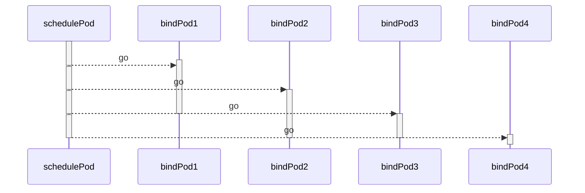
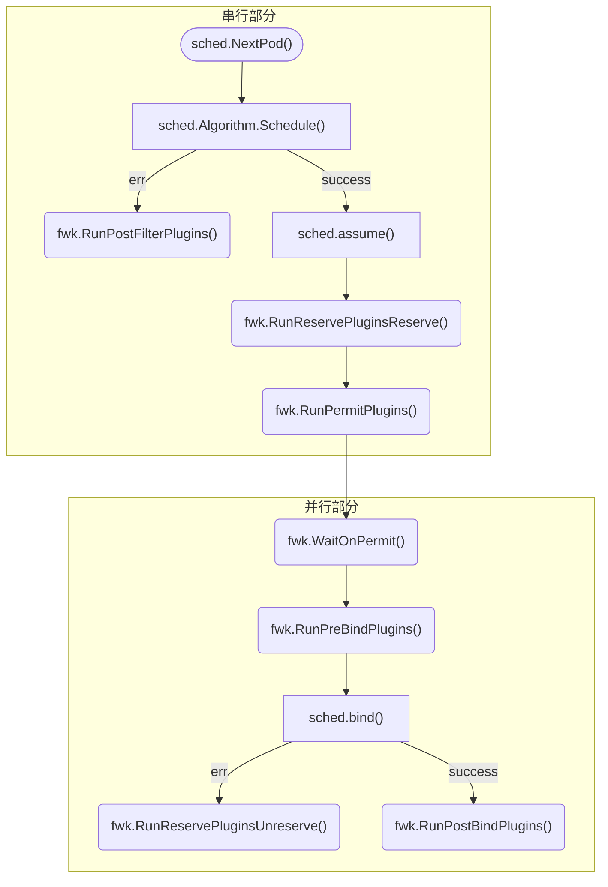

# scheduler 2

书接上一回，上次我们分析了在 `cmd/kube-scheduler/` 下，从 `main()` 开始直到 `sched.Run()` 启动的过程。在 `cmd/kube-scheduler/app/server.go` 的 `Setup` 函数中，调用 `scheduler.New()` 实例化出 `sched` ，并在 `Run` 函数中调用 `sched.Run()` 启动循环。因此接下来我们将分析 `pkg/scheduler/` 这个包。

> 接下来如无特意标记， `.` 开头的相对路径都为从 `/pkg/scheduler/` 开始的相对路径。

## sched.Run()

我们开始看 `sched` 的这个 `Run` 方法。

为什么我们不先看 `New` 函数呢？我们点进 `New` 略微看一下，发现它一直都在做 `sched` 各个成员的初始化。单看 `sched` 看不出什么，但要是所有成员一个一个看内容又太多，容易弄晕自己。我们打算先把 `sched` 在做什么整体过一遍，在回来仔细看看每一个细节。

我们点进 `sched.Run(ctx)` ，发现这个函数很短小，只有三行代码：

```go ./scheduler.go
// Run begins watching and scheduling. It starts scheduling and blocked until the context is done.
func (sched *Scheduler) Run(ctx context.Context) {
	sched.SchedulingQueue.Run()
	wait.UntilWithContext(ctx, sched.scheduleOne, 0)
	sched.SchedulingQueue.Close()
}
```

注释已经明显写清楚这个函数会 block 了（当然了，之前在 `sched.Run(ctx)` 后面可是没有任何 wait 的）。
虽然我们一眼就能看出来最重要的是中间这行，而且最重要的还是 `sched.scheduleOne` 这个函数（为什么我知道他是个函数？鼠标放上去看看嘛）。但我们还是放慢脚步，看看前后两行在做什么。动动鼠标：

`sched.SchedulingQueue` ：
![[2022-04-13-18-51-12.png]]

`SchedulingQueue.Run()` ：
![[2022-04-13-18-52-10.png]]

`SchedulingQueue.Close()` ：
![[2022-04-13-18-52-37.png]]

很清晰了， `sched.SchedulingQueue` 是用来放还未被分配的 Pod 的，需要运行一些线程来维持，一前一后就是做这个的。

那么接下来我们来看 `sched.scheduleOne` …… 别急，我们先来看看 `wait.UntilWithContext` 做了些什么。从名字我们大概可以猜到，这个函数是循环去调用 `sched.scheduleOne` ，然后 `ctx` 关闭了就立即退出。我们主要看看他是怎么实现的，估计会很有参考价值。

## k8s 的 wait 包

点进 `wait.UntilWithContext` ……
`UntilWithContext` -> `JitterUntilWithContext` -> `JitterUntil` -> `BackoffUntil` 怎么一层套一层啊……

我们先别慌，上下一看其实都是语法糖，主要还是看一下 `BackoffUntil` ，我们先看注释：
> BackoffUntil loops until stop channel is closed, run f every duration given by BackoffManager.
> If sliding is true, the period is computed after f runs. If it is false then period includes the runtime for f.

翻译一下： `BackoffUntil` 会一直循环执行 `f` ，直到 `stopCh` 关闭。循环周期由 `BackoffManager` 管理，而 `sliding` 表示一个周期的时间内是否包含 `f` 的运行时间。

先看代码：

```go
func BackoffUntil(f func(), backoff BackoffManager, sliding bool, stopCh <-chan struct{}) {
	var t clock.Timer
	for {
		select {
		case <-stopCh:
			return
		default:
		}

		if !sliding {
			t = backoff.Backoff()
		}

		func() {
			defer runtime.HandleCrash()
			f()
		}()

		if sliding {
			t = backoff.Backoff()
		}

		// NOTE: b/c there is no priority selection in golang
		// it is possible for this to race, meaning we could
		// trigger t.C and stopCh, and t.C select falls through.
		// In order to mitigate we re-check stopCh at the beginning
		// of every loop to prevent extra executions of f().
		select {
		case <-stopCh:
			if !t.Stop() {
				<-t.C()
			}
			return
		case <-t.C():
		}
	}
}

```

发现是一整个 while 循环，循环内分三部分：
1. 前面一个 select ，是为了监听 `stopCh` ，如果关闭就退出循环。
2. 中间外围是 sliding 相关，如果 sliding 则在 `f` 执行后开始一个周期的计时，否则在 `f` 执行前计时。 `f` 执行后还会处理 Crash 。
3. 后面一个 select ，是为了等待周期计时。如果 `stopCh` 先被关闭，就会立即返回而不等待周期结束。

`backoff.Backoff()` 会返回等待一个周期的 Timer ，一路追踪回去，发现周期就是最初输入的参数 `period` 。我们再看看最初的入口：

```go ./scheduler.go
wait.UntilWithContext(ctx, sched.scheduleOne, 0)
```
我们输入的 `period` 值为零。我们现在就很清晰了，这一段就是在不断调用 `sched.scheduleOne` ，在一次调用结束后立刻进行下一次调用，不断循环直到 `ctx` 被 cancel 。联系一下上节讲的通过 context 进行线程同步，说过 `ctx` 被 cancel 后所有线程都会同步结束，这其中也包括 `sched` 。

另外多说几句， `wait` 这个包不大，上下看一遍发现基本都在做线程同步、等待之类的工作，比较有学习价值，大家可以自己多研究一下。

## sched.scheduleOne

我们接下来看看每次循环内都做了些什么。点进 `scheduleOne` ，发现这个方法有点长，毕竟是整个 scheduler 最核心的一段了。我根据我的理解，给大家简化一下：

```go ./scheduler.go
// scheduleOne does the entire scheduling workflow for a single pod. It is serialized on the scheduling algorithm's host fitting.
func (sched *Scheduler) scheduleOne(ctx context.Context) {
	podInfo := sched.NextPod()
	pod := podInfo.Pod
	fwk, err := sched.frameworkForPod(pod)
    
    // ...

	// Synchronously attempt to find a fit for the pod.
	state := framework.NewCycleState()
	// ...
	// Initialize an empty podsToActivate struct, which will be filled up by plugins or stay empty.
	podsToActivate := framework.NewPodsToActivate()
	state.Write(framework.PodsToActivateKey, podsToActivate)

	schedulingCycleCtx, cancel := context.WithCancel(ctx)
	defer cancel()
	scheduleResult, err := sched.Algorithm.Schedule(schedulingCycleCtx, sched.Extenders, fwk, state, pod)
	if err != nil {
		// Schedule() may have failed because the pod would not fit on any host, so we try to
		// preempt, with the expectation that the next time the pod is tried for scheduling it
		// will fit due to the preemption. It is also possible that a different pod will schedule
		// into the resources that were preempted, but this is harmless.
		

        // Run PostFilter plugins to try to make the pod schedulable in a future scheduling cycle.
        result, status := fwk.RunPostFilterPlugins(ctx, state, pod, fitError.Diagnosis.NodeToStatusMap)

        // Pod did not fit anywhere, so it is counted as a failure. If preemption
        // succeeds, the pod should get counted as a success the next time we try to
        // schedule it. (hopefully)
        //...

		return
	}
	
	// Tell the cache to assume that a pod now is running on a given node, even though it hasn't been bound yet.
	// This allows us to keep scheduling without waiting on binding to occur.
	assumedPodInfo := podInfo.DeepCopy()
	assumedPod := assumedPodInfo.Pod
	// assume modifies `assumedPod` by setting NodeName=scheduleResult.SuggestedHost
	err = sched.assume(assumedPod, scheduleResult.SuggestedHost)

	// Run the Reserve method of reserve plugins.
	sts := fwk.RunReservePluginsReserve(schedulingCycleCtx, state, assumedPod, scheduleResult.SuggestedHost)

	// Run "permit" plugins.
	runPermitStatus := fwk.RunPermitPlugins(schedulingCycleCtx, state, assumedPod, scheduleResult.SuggestedHost)

	// At the end of a successful scheduling cycle, pop and move up Pods if needed.
	if len(podsToActivate.Map) != 0 {
		sched.SchedulingQueue.Activate(podsToActivate.Map)
		// Clear the entries after activation.
		podsToActivate.Map = make(map[string]*v1.Pod)
	}

	// bind the pod to its host asynchronously (we can do this b/c of the assumption step above).
	go func() {
		bindingCycleCtx, cancel := context.WithCancel(ctx)
		defer cancel()

		waitOnPermitStatus := fwk.WaitOnPermit(bindingCycleCtx, assumedPod)

		// Run "prebind" plugins.
		preBindStatus := fwk.RunPreBindPlugins(bindingCycleCtx, state, assumedPod, scheduleResult.SuggestedHost)

		err := sched.bind(bindingCycleCtx, fwk, assumedPod, scheduleResult.SuggestedHost, state)
		
        // Calculating nodeResourceString can be heavy. Avoid it if klog verbosity is below 2.
        if klog.V(2).Enabled() {
            klog.InfoS("Successfully bound pod to node", "pod", klog.KObj(pod), "node", scheduleResult.SuggestedHost, "evaluatedNodes", scheduleResult.EvaluatedNodes, "feasibleNodes", scheduleResult.FeasibleNodes)
        }

        // Run "postbind" plugins.
        fwk.RunPostBindPlugins(bindingCycleCtx, state, assumedPod, scheduleResult.SuggestedHost)

        // At the end of a successful binding cycle, move up Pods if needed.
        if len(podsToActivate.Map) != 0 {
            sched.SchedulingQueue.Activate(podsToActivate.Map)
            // Unlike the logic in scheduling cycle, we don't bother deleting the entries
            // as `podsToActivate.Map` is no longer consumed.
        }
	}()
}
```

结合注释我们可以看到，整个 schedule 的过程都是串行的，每一步如果出现 error 都会直接返回开始下一个周期。而当整个 schedule 过程成功后，会启动一个 goroutine 开始 bind 过程，也即每个周期的 bind 过程都是并发进行的。
如果你觉得上面的代码段仍比较长，我还整理出了一个究极简化版：

```go ./scheduler.go
// scheduleOne does the entire scheduling workflow for a single pod. It is serialized on the scheduling algorithm's host fitting.
func (sched *Scheduler) scheduleOne(ctx context.Context) {
	podInfo := sched.NextPod()
	fwk, err := sched.frameworkForPod(pod)

	scheduleResult, err := sched.Algorithm.Schedule(schedulingCycleCtx, sched.Extenders, fwk, state, pod)
	if err != nil {
        result, status := fwk.RunPostFilterPlugins(ctx, state, pod, fitError.Diagnosis.NodeToStatusMap)
		return
	}
    
	err = sched.assume(assumedPod, scheduleResult.SuggestedHost)

	// bind the pod to its host asynchronously (we can do this b/c of the assumption step above).
	go func() {
		err := sched.bind(bindingCycleCtx, fwk, assumedPod, scheduleResult.SuggestedHost, state)
	}()
}
```
把插件逻辑、错误处理等都删了，够简短了吧……

我们可以看到，最主要的还是以下几个步骤：
1. 主要 schedule 逻辑，返回一个可用的 node ， `sched.Algorithm.Schedule()`
2. 若 Schedule 失败，进入 preempt 逻辑，即 `fwk.RunPostFilterPlugins()`
3. schedule 成功后，将 pod 的 schedule 信息加到缓存中，即 `sched.assume()` ，由此使得 bind 步骤可并发进行
4. 主要 bind 逻辑，即 `sched.bind()` ，负责把 pod 绑定到 schedule 返回的 node 上

而最重要的对象大概有两个，一个当然是 pod ，而另一个，从 `sched.frameworkForPod(pod)` 返回的 Framework 实例 `fwk` 也是比较重要的，我们可以看到几乎所有步骤都要从这个 `fwk` 调用。


## framework.Framework

上一节中，这个 `fwk` 到底是谁？我们来追踪一下。我们点进 `sched.frameworkForPod(pod)` ，发现他是从 `sched.Profiles` 这个 map 里拿到的。我们想看看这个 map 成员是怎么构建的嘛，一路往回追踪！

在 `scheduler.New()` 里（还记得我们 sched 实例怎么构建出来的吗？），找到：

```go ./scheduler.go
sched, err := configurator.create()
```

点开，找到这么一段：

```go ./factory.go
profiles, err := profile.NewMap(c.profiles, c.registry, c.recorderFactory,
    frameworkruntime.WithComponentConfigVersion(c.componentConfigVersion),
    frameworkruntime.WithClientSet(c.client),
    frameworkruntime.WithKubeConfig(c.kubeConfig),
    frameworkruntime.WithInformerFactory(c.informerFactory),
    frameworkruntime.WithSnapshotSharedLister(c.nodeInfoSnapshot),
    frameworkruntime.WithRunAllFilters(c.alwaysCheckAllPredicates),
    frameworkruntime.WithPodNominator(nominator),
    frameworkruntime.WithCaptureProfile(frameworkruntime.CaptureProfile(c.frameworkCapturer)),
    frameworkruntime.WithClusterEventMap(c.clusterEventMap),
    frameworkruntime.WithParallelism(int(c.parallellism)),
    frameworkruntime.WithExtenders(extenders),
)
```

点开 `NewMap()` ，发现其实就是遍历 cfgs 构建 map 的过程。最终会调用 `frameworkruntime.NewFramework()` 构建 framework 实例。

其实吧，这个构建链比较长，我们可以用另一种方式去找。
我们可以注意到： `framework.Framework` 这个类型是个 interface ，整个仓库中只有有唯一的一个实现 `frameworkImpl` ，在 `./framework/runtime/framework.go` 中。 而 `frameworkImpl` 只有一个公开的构建方法 `NewFramework()` 这样我们就找到同一个地方了。

一如既往的，我们不打算看 New 函数，毕竟不了解实例具体在做什么，看构造函数也看不出什么来。我们只要先记住这个入口在哪里，参数是什么样的，就可以了。


我们找到 framework 的真身了，我们就可以回到 `scheduleOne()` ，关注一下我们省略掉的几个 plugin 调用：
1. fwk.RunReservePluginsReserve
2. fwk.RunPermitPlugins 与 fwk.WaitOnPermit
3. fwk.RunPreBindPlugins
4. fwk.RunPostBindPlugins

我们现在还不好深入去探究每个步骤做了些什么（因为都是些 Interface ）。不过我们可以粗略看一下 `framework.Framework` 这个 interface ，发现他主要的方法都是在 Run 一些 Plugin 。

其实我之前看过别人写的 1.13 版的源码阅读，那时候的 scheduleOne 是有 assumeVolumes 和 bindVolumes 步骤的。我们现在 1.23 版本已经看不见了，估计是放到 framework 的哪些 interface 里了。

所以我们接下来要做的事情要分两步：

1. 主要的，我们要研究 `scheduleOne()` 中没被并入 framework 的部分，即 `sched.Algorithm.Schedule()` ， `sched.assume()` ， `sched.bind()` 。
2. 次要但重要的，我们要简单研究一下 `framework.Framework` 大概做了哪些工作，这些 interface 都有哪些默认实现。


#### deprecated

最后在 `New()` 中（还记得我们的 sched 也是调用这个 New 构建出来的吗？），发现它跟 Option 的 profiles 成员有关。（追踪的中间过程有点长又没什么营养，我们就省略了）

而 Option 的 profiles 成员怎么来的？我们回过头来看看在 cmd 里我们怎么调用 `New()` 的：

```go /cmd/kube-scheduler/app/server.go
sched, err := scheduler.New(cc.Client,
    cc.InformerFactory,
    cc.DynInformerFactory,
    recorderFactory,
    ctx.Done(),
    scheduler.WithComponentConfigVersion(cc.ComponentConfig.TypeMeta.APIVersion),
    scheduler.WithKubeConfig(cc.KubeConfig),
    scheduler.WithProfiles(cc.ComponentConfig.Profiles...),
    scheduler.WithPercentageOfNodesToScore(cc.ComponentConfig.PercentageOfNodesToScore),
    scheduler.WithFrameworkOutOfTreeRegistry(outOfTreeRegistry),
    scheduler.WithPodMaxBackoffSeconds(cc.ComponentConfig.PodMaxBackoffSeconds),
    scheduler.WithPodInitialBackoffSeconds(cc.ComponentConfig.PodInitialBackoffSeconds),
    scheduler.WithExtenders(cc.ComponentConfig.Extenders...),
    scheduler.WithParallelism(cc.ComponentConfig.Parallelism),
    scheduler.WithBuildFrameworkCapturer(func(profile kubeschedulerconfig.KubeSchedulerProfile) {
        // Profiles are processed during Framework instantiation to set default plugins and configurations. Capturing them for logging
        completedProfiles = append(completedProfiles, profile)
    }),
)
```

看到 `scheduler.WithProfiles(cc.ComponentConfig.Profiles...)` 了吗？我们点开就会看到他就是给我们设置 profile 的人。
我们再继续追踪这个 `cc.ComponentConfig.Profiles` 怎么来的。我们一直找到 `option` 的 `ApplyTo` 方法：

```go
if len(o.ConfigFile) == 0 {
    // If the --config arg is not specified, honor the deprecated as well as leader election CLI args.
    o.ApplyDeprecated()
    o.ApplyLeaderElectionTo(o.ComponentConfig)
    c.ComponentConfig = *o.ComponentConfig
} else {
    cfg, err := loadConfigFromFile(o.ConfigFile)
    if err != nil {
        return err
    }
    // If the --config arg is specified, honor the leader election CLI args only.
    o.ApplyLeaderElectionTo(cfg)

    if err := validation.ValidateKubeSchedulerConfiguration(cfg); err != nil {
        return err
    }

    c.ComponentConfig = *cfg
}
```

而这个 `o.ConfigFile` 是

懵逼了，到头来什么都没找到。


## 最后一点小工作

回到 `scheduleOne()` ，猜也知道， `sched.Algorithm.Schedule()` 中一定是 scheduler 最重要的调度算法部分，我们之后单独拿出来说。我们主要看 `sched.assume()` 与 `sched.bind()` 。

点进 `sched.assume()` ，发现代码很简短，主要是调用 AssumePod ：

```go ./scheduler.go
// assume signals to the cache that a pod is already in the cache, so that binding can be asynchronous.
// assume modifies `assumed`.
func (sched *Scheduler) assume(assumed *v1.Pod, host string) error {
	// Optimistically assume that the binding will succeed and send it to apiserver
	// in the background.
	// If the binding fails, scheduler will release resources allocated to assumed pod
	// immediately.
	assumed.Spec.NodeName = host

	if err := sched.SchedulerCache.AssumePod(assumed); err != nil {
		klog.ErrorS(err, "Scheduler cache AssumePod failed")
		return err
	}
	// if "assumed" is a nominated pod, we should remove it from internal cache
	if sched.SchedulingQueue != nil {
		sched.SchedulingQueue.DeleteNominatedPodIfExists(assumed)
	}

	return nil
}
```

而另一边 `sched.bind()` 则主要是调用 framework ：

```go .scheduler.go
// bind binds a pod to a given node defined in a binding object.
// The precedence for binding is: (1) extenders and (2) framework plugins.
// We expect this to run asynchronously, so we handle binding metrics internally.
func (sched *Scheduler) bind(ctx context.Context, fwk framework.Framework, assumed *v1.Pod, targetNode string, state *framework.CycleState) (err error) {
	defer func() {
		sched.finishBinding(fwk, assumed, targetNode, err)
	}()

	bound, err := sched.extendersBinding(assumed, targetNode)
	if bound {
		return err
	}
	bindStatus := fwk.RunBindPlugins(ctx, state, assumed, targetNode)
	if bindStatus.IsSuccess() {
		return nil
	}
	if bindStatus.Code() == framework.Error {
		return bindStatus.AsError()
	}
	return fmt.Errorf("bind status: %s, %v", bindStatus.Code().String(), bindStatus.Message())
}

```

所以我们接下来可以集中精力到 `Schedule()` 中了。

## 总结一下

我们这次主要分析了 `sched.Run()` 以及 `sched.scheduleOne()` 的内容。
在 `sched.Run()` 中，我们通过 `wait.UntilWithContext()` 不断循环调用 `sched.scheduleOne()` 。在每次调用中串行执行每个 pod 的调度，并在最后 go 出一个协程进行 bind 操作。类似下图：



而对于一个 pod 来说，会经过如下图操作：



下一篇，我们会深入 `sched.Algorithm.Schedule()` ，仔细探究一下 scheduler 最核心的算法部分。


