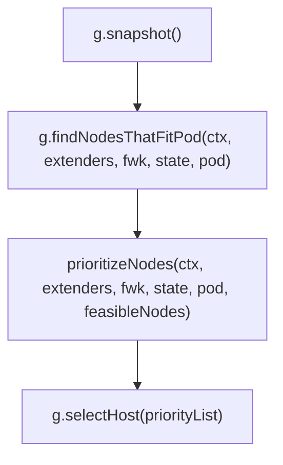

# schedule

我们上次分析了在 `pkg/scheduler` 下 `scheduler` 实例的运行入口 `sched.Run()` 。它主要在不断循环执行 `sched.shceduleOne()` ，而对于每一个 pod 来说， schedule 部分是串行执行的，而 schedule 成功后的 bind 部分则不会相互冲突，是并行执行的。

接下来，我们分析一个 pod 调度的核心算法部分。也即是 `sched.Algorithm.Schedule()` 。

以下以 `.` 开头的相对路径，都是指 `pkg/scheduler` 下的相对路径。

## sched.Algorithm

`sched.Algorithm` 是一个 `ScheduleAlgorithm` 接口，我们看到它只有一个方法 `Schedule()` 。在项目中这个接口有唯一的一个实现 `genericScheduler` ，位于 `./generic_scheduler.go` 中。

![[2022-04-16-22-05-02.png|generic_shceduler.go 的结构]]

本来按照前几篇的节奏，这里应该先带大家看 New 方法，看他怎么实例化的……但我追踪了一遍，都是从配置里创建出来的，没什么营养，解说也挺浪费时间的。（我现在觉得之前两篇中解说 New 方法的部分都挺浪费时间的……）
大概只要知道，是在 `scheduler.New()` 的 `configurator.create()` 里创建出来的就行了。（实际上整个 `sched` 都是这里创建的……）

我们接下来直接看最重要的 `Schedule()` 方法。

## Schedule()

删去无关紧要的逻辑后，代码如下（注释是我手动从各个函数复制过来的）：

```go ./generic_scheduler.go
// Schedule tries to schedule the given pod to one of the nodes in the node list.
// If it succeeds, it will return the name of the node.
// If it fails, it will return a FitError error with reasons.
func (g *genericScheduler) Schedule(ctx context.Context, extenders []framework.Extender, fwk framework.Framework, state *framework.CycleState, pod *v1.Pod) (result ScheduleResult, err error) {

    // snapshot snapshots scheduler cache and node infos for all fit and priority
    // functions.
	err := g.snapshot()

    // Filters the nodes to find the ones that fit the pod based on the framework
    // filter plugins and filter extenders.
	feasibleNodes, diagnosis, err := g.findNodesThatFitPod(ctx, extenders, fwk, state, pod)

    // prioritizeNodes prioritizes the nodes by running the score plugins,
    // which return a score for each node from the call to RunScorePlugins().
    // The scores from each plugin are added together to make the score for that node, then
    // any extenders are run as well.
    // All scores are finally combined (added) to get the total weighted scores of all nodes
	priorityList, err := prioritizeNodes(ctx, extenders, fwk, state, pod, feasibleNodes)

    // selectHost takes a prioritized list of nodes and then picks one
    // in a reservoir sampling manner from the nodes that had the highest score.
	host, err := g.selectHost(priorityList)

	return ScheduleResult{
		SuggestedHost:  host,
		EvaluatedNodes: len(feasibleNodes) + len(diagnosis.NodeToStatusMap),
		FeasibleNodes:  len(feasibleNodes),
	}, err
}
```

整体已经究极清晰了，就四步：



我们从注释与函数签名也可得出，整个 `Schedule()` 方法要做的只有一件事：
从所有 node 中，找到唯一一个最适合 pod 的 node 。

而每一步的命名比较明显，结合注释、函数签名，我们已经能有个大概了解：
1. `g.snapshot()` 负责将 cache 中的 node 信息拷贝到 `g.nodeInfoSnapshot` 中，以供 fit 和 priority 函数使用。
2. `g.findNodesThatFitPod()` 负责从上一步得到的所有 node 中找出符合条件的 node ，并返回 node 列表。是否符合条件由 `fwk` 的 filter plugins 和 filter extenders 来判断。如果找到有且仅有 1 个 node 时直接返回。
3. `prioritizeNodes()` 通过对上一步返回的 node 打分，来给 node 划分优先级。分数由 `fwk` 的 score plugins 以及 extenders 来计算，最终各 plugins 返回的分数相加后得出 node 的分数。最后返回的 `framework.NodeScoreList` 类型变量是一个 node 名与其得分的列表。
4. `g.selectHost()` 负责从上一步返回的列表中选择得分最高的 node 。

把上面过程总结成一句话，就是：先预选，再优选。由此我们可以知道，上面四步里最重要的就是第二第三步，也分别就是预选和优选的过程。这两步我们后面仔细分别来讲，这篇里我们把剩下的第一步和第四步讲清楚。

## g.snapshot()

点进 `g.snapshot()` ，我们发现这个函数很简单，就一行：

```go ./generic_scheduler.go
// snapshot snapshots scheduler cache and node infos for all fit and priority
// functions.
func (g *genericScheduler) snapshot() error {
	// Used for all fit and priority funcs.
	return g.cache.UpdateSnapshot(g.nodeInfoSnapshot)
}
```

这个 `g.cache` 的类型是 `internalcache.Cache` 接口，我们看一下接口中 `UpdateSnapshot()` 的注释：

```go ./internal/cache/interface.go
// UpdateSnapshot updates the passed infoSnapshot to the current contents of Cache.
// The node info contains aggregated information of pods scheduled (including assumed to be)
// on this node.
// The snapshot only includes Nodes that are not deleted at the time this function is called.
// nodeinfo.Node() is guaranteed to be not nil for all the nodes in the snapshot.
UpdateSnapshot(nodeSnapshot *Snapshot) error
```

就是说这个方法会把 cache 里的 node 信息同步到输入的 `nodeSnapshot` 参数中。结合 generic_scheduler 中调用的形式，就是把 `g.cache` 同步到 `g.nodeInfoSnapshot` 了。

`Cache` 接口有唯一的一个实现 `schedulerCache` ，位于 `./internal/cache/cache.go` 中。由于 `Cache` 涉及范围过广，我们现在先不再深入，等以后有机会再集中研究一下 `Cache` 。

## g.selectHost()

这个方法也比较短，代码及注释如下：

```go ./generic_shceduler.go
// selectHost takes a prioritized list of nodes and then picks one
// in a reservoir sampling manner from the nodes that had the highest score.
func (g *genericScheduler) selectHost(nodeScoreList framework.NodeScoreList) (string, error) {
	if len(nodeScoreList) == 0 {
		return "", fmt.Errorf("empty priorityList")
	}
	maxScore := nodeScoreList[0].Score
	selected := nodeScoreList[0].Name
	cntOfMaxScore := 1
	for _, ns := range nodeScoreList[1:] {
		if ns.Score > maxScore {
			maxScore = ns.Score
			selected = ns.Name
			cntOfMaxScore = 1
		} else if ns.Score == maxScore {
			cntOfMaxScore++
			if rand.Intn(cntOfMaxScore) == 0 {
				// Replace the candidate with probability of 1/cntOfMaxScore
				selected = ns.Name
			}
		}
	}
	return selected, nil
}
```

这个方法就有意思了，我们仔细来品。注释第一行很简单，就是这个方法接受一个打过分的 node list ，然后从中挑一个。怎么样挑的呢？这就是第二行的内容了，主要有两个关键词： reservoir sampling 和 highest score 。

highest score 很好懂，就是取最高得分的 node 嘛。我们把本来就短的这个函数再简化一下：

```go ./generic_scheduler.go
maxScore := nodeScoreList[0].Score
selected := nodeScoreList[0].Name
for _, ns := range nodeScoreList[1:] {
    if ns.Score > maxScore {
        maxScore = ns.Score
        selected = ns.Name
    }
}
return selected, nil
```

这样看就很简单了，不就是遍历一遍找出最高分的 node 嘛，相信大家刚学编程都知道怎么写。

而 reservoir sampling 就有趣一点。这个词的中文是 “蓄水池采样” 。相信各位估计一看名字就已经明白了，但我还是稍微解释一下蓄水池采样：

假如我们需要从一个未知长度的序列里随机抽取 m 个数。

我们开辟一个长度为 m 的“蓄水池”，然后从头遍历这个未知序列。遍历到第 i 个元素时（ m < i ），我们以 m/i 的概率把他放入蓄水池中，并随机替换掉蓄水池中的一个元素。（也就是一个元素被替换的概率是 1/m）最后留在蓄水池中的元素就是我们抽取出来的 m 个元素。

假设整个序列长度为 n ，可以证明每个元素最后留下来的概率都是 m/n （证明过程很简单，不再赘述了），也就是每个元素留下来的可能性都是均等的。

蓄水池采样的好处是不需要知道序列的长度，适用于无限长或是流式数据的采样。 kubernetes 的调度器一般会假设 node 的数量十分多，因此适用于蓄水池采样的场景。但在这里我们只需要选取出一个 node 就行了，所以没有特意开辟长度为 m 的蓄水池（也可以认为蓄水池的长度为 1 ）。

我们再把代码以另一种角度简化一下：

```go ./generic_scheduler.go
	maxScore := nodeScoreList[0].Score
	selected := nodeScoreList[0].Name
	cntOfMaxScore := 1
	for _, ns := range nodeScoreList[1:] {
		if ns.Score > maxScore {
            // 更新 maxScore 与 selected
			cntOfMaxScore = 1
		} else if ns.Score == maxScore {
			cntOfMaxScore++
			if rand.Intn(cntOfMaxScore) == 0 {
				// Replace the candidate with probability of 1/cntOfMaxScore
				selected = ns.Name
			}
		}
	}
	return selected, nil
```

我们看到只有当 node 的 score 是 maxScore 时才会被抽取，因此这里的 `cntOfMaxScore` 相当于上面一般抽水池采样中的 i 。那么我们自然知道，如果有 n 个 node 同时拥有相同最高 score ，那么最终每个 node 被选中的概率都相等为 1/n 。

因此整个 `g.selectHost()` 利用类似蓄水池采样的方法，做到以均等的概率从 score 最高的 node 中返回一个 node 。

## 总结一下

这次我们主要分析了 `sched.scheduleOne()` 中最核心的 `sched.Algorithm.Schedule()` 的实现。这个方法主要有四步：


最重要的是第二、三步的预选与优选，留到后面仔细分析。这次我们分析了第一步和第四步，第四步用蓄水池采样的思路，从最高 score 的几个 node 中随机取出一个 node 。
