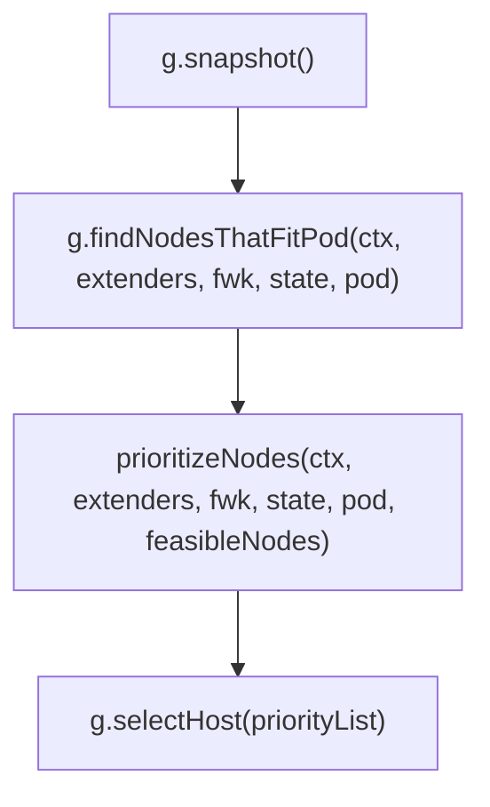

# schedule

我们上次分析了在 `pkg/scheduler` 下 `scheduler` 实例的运行入口 `sched.Run()` 。它主要在不断循环执行 `sched.shceduleOne()` ，而对于每一个 pod 来说， schedule 部分是串行执行的，而 schedule 成功后的 bind 部分则不会相互冲突，是并行执行的。

接下来，我们分析一个 pod 调度的核心算法部分。也即是 `sched.Algorithm.Schedule()` 。

以下以 `.` 开头的相对路径，都是指 `pkg/scheduler` 下的相对路径。

## sched.Algorithm

`sched.Algorithm` 是一个 `ScheduleAlgorithm` 接口，我们看到它只有一个方法 `Schedule()` 。在项目中这个接口有唯一的一个实现 `genericScheduler` ，位于 `./generic_scheduler.go` 中。

![[2022-04-16-22-05-02.png|generic_shceduler.go 的结构]]

本来按照前几篇的节奏，这里应该先带大家看 New 方法，看他怎么实例化的……但我追踪了一遍，都是从配置里创建出来的，没什么营养，解说也挺浪费时间的。（我现在觉得之前两篇中解说 New 方法的部分都挺浪费时间的……）
大概只要知道，是在 `scheduler.New()` 的 `configurator.create()` 里创建出来的就行了。（实际上整个 `sched` 都是这里创建的……）

我们接下来直接看最重要的 `Schedule()` 方法。

## Schedule()

删去无关紧要的逻辑后，代码如下（注释是我手动从各个函数复制过来的）：

```go ./generic_scheduler.go
// Schedule tries to schedule the given pod to one of the nodes in the node list.
// If it succeeds, it will return the name of the node.
// If it fails, it will return a FitError error with reasons.
func (g *genericScheduler) Schedule(ctx context.Context, extenders []framework.Extender, fwk framework.Framework, state *framework.CycleState, pod *v1.Pod) (result ScheduleResult, err error) {

    // snapshot snapshots scheduler cache and node infos for all fit and priority
    // functions.
	err := g.snapshot()

    // Filters the nodes to find the ones that fit the pod based on the framework
    // filter plugins and filter extenders.
	feasibleNodes, diagnosis, err := g.findNodesThatFitPod(ctx, extenders, fwk, state, pod)

    // prioritizeNodes prioritizes the nodes by running the score plugins,
    // which return a score for each node from the call to RunScorePlugins().
    // The scores from each plugin are added together to make the score for that node, then
    // any extenders are run as well.
    // All scores are finally combined (added) to get the total weighted scores of all nodes
	priorityList, err := prioritizeNodes(ctx, extenders, fwk, state, pod, feasibleNodes)

    // selectHost takes a prioritized list of nodes and then picks one
    // in a reservoir sampling manner from the nodes that had the highest score.
	host, err := g.selectHost(priorityList)

	return ScheduleResult{
		SuggestedHost:  host,
		EvaluatedNodes: len(feasibleNodes) + len(diagnosis.NodeToStatusMap),
		FeasibleNodes:  len(feasibleNodes),
	}, err
}
```

整体已经究极清晰了，就四步：



我们从注释与函数签名也可得出，整个 `Schedule()` 方法要做的只有一件事：
从所有 node 中，找到唯一一个最适合 pod 的 node 。

而每一步的命名比较明显，结合注释、函数签名，我们已经能有个大概了解：
1. `g.snapshot()` 负责将 cache 中的 node 信息拷贝到 `g.nodeInfoSnapshot` 中，以供 fit 和 priority 函数使用。
2. `g.findNodesThatFitPod()` 负责从上一步得到的所有 node 中找出符合条件的 node ，并返回 node 列表。是否符合条件由 `fwk` 的 filter plugins 和 filter extenders 来判断。如果找到有且仅有 1 个 node 时直接返回。
3. `prioritizeNodes()` 通过对上一步返回的 node 打分，来给 node 划分优先级。分数由 `fwk` 的 score plugins 以及 extenders 来计算，最终各 plugins 返回的分数相加后得出 node 的分数。最后返回的 `framework.NodeScoreList` 类型变量是一个 node 名与其得分的列表。
4. `g.selectHost()` 负责从上一步返回的列表中选择得分最高的 node 。
